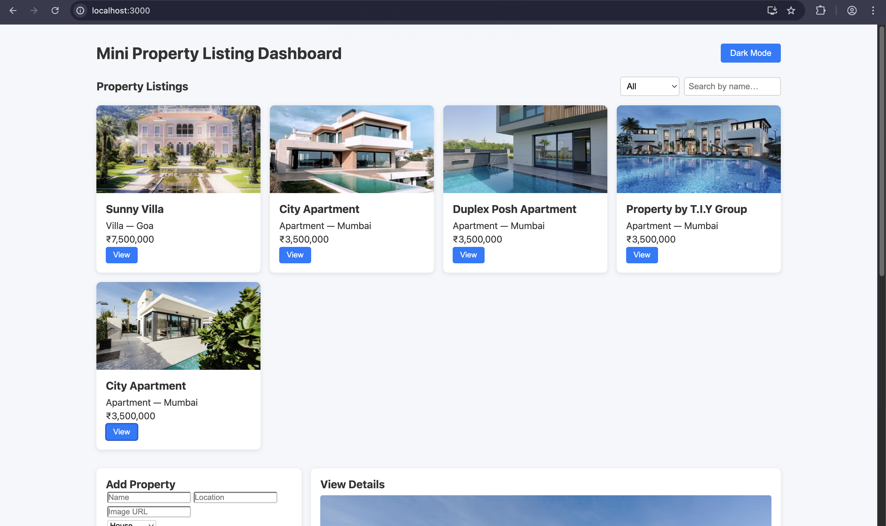
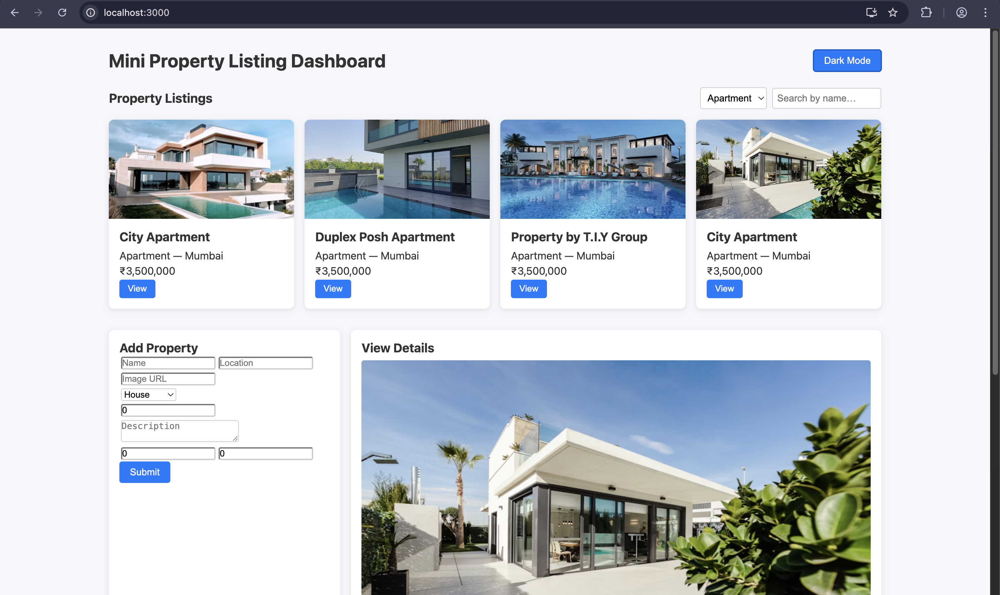
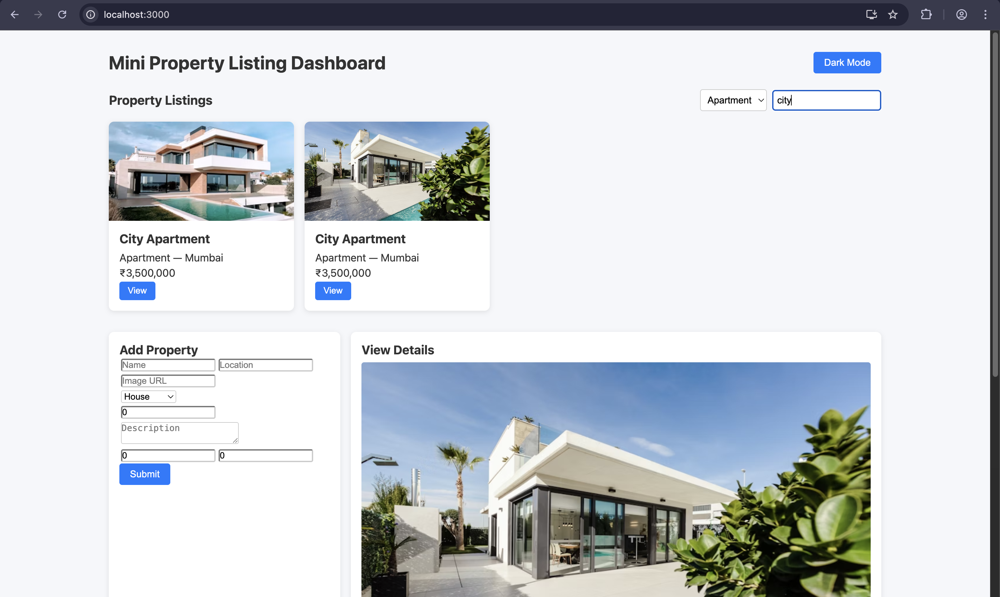
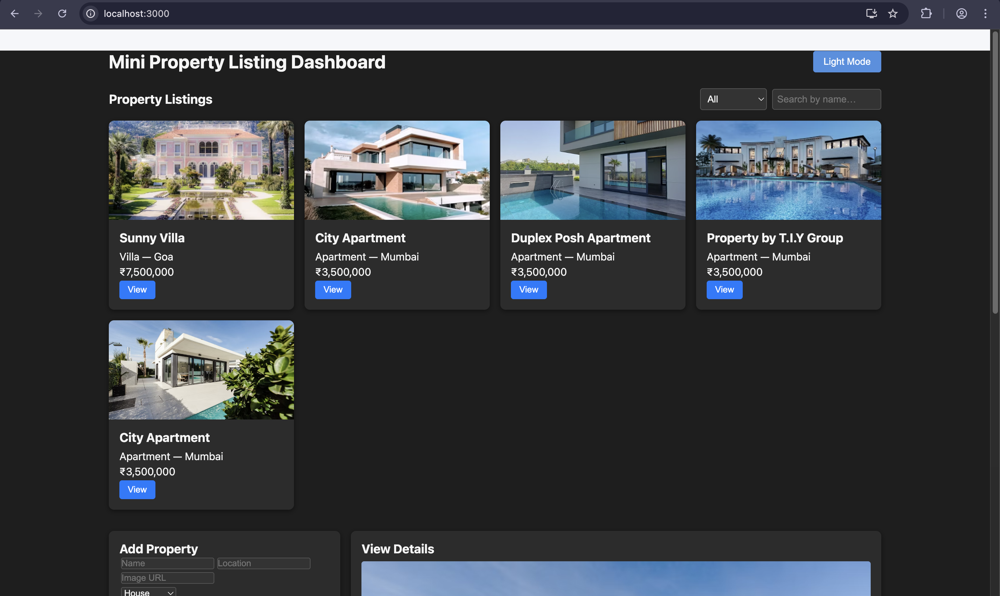

# React Property Listing

A mini property listing dashboard built with React and TypeScript for browsing, filtering, adding, and viewing property details.

## Live Demo


> Live link:
> `https://react-property-listing.eu`

## Topics

`react` `typescript` `create-react-app` `property-listing` `dashboard` `state-management` `filtering` `mock-api` `dark-mode` `frontend-project`

## Screenshots


### Dashboard



### Filters


### Add Property Form


### Property Details


### Dark Mode


## Overview

React Property Listing is a mini frontend dashboard that allows users to explore property cards, filter listings, add new properties, and inspect selected property details in a dedicated details panel. The project uses a clean component-based structure and local mock data, making it suitable for frontend learning, UI assignments, and portfolio demonstrations.

## Architecture Summary

The application follows a simple React component architecture with centralized state managed through Context API.

### Main structure

- `src/App.tsx`  
  Entry point for the main dashboard layout. Wraps the app with `PropertyProvider` and renders the main UI sections.

- `src/contexts/PropertyContext.tsx`  
  Handles shared state such as:
  - property data
  - filtered property list
  - dark mode toggle
  - filtering logic

- `src/components/FilterBar.tsx`  
  Provides UI controls for filtering property listings.

- `src/components/PropertyCard.tsx`  
  Renders individual property cards in the grid.

- `src/components/AddPropertyForm.tsx`  
  Handles property creation through a form-based UI.

- `src/components/DetailsModal.tsx`  
  Displays detailed information for the currently selected property.

- `public/mock-api/properties.json`  
  Stores mock property data used by the app.

### Data flow

1. Property data is loaded into shared state.
2. Filters update the visible `filtered` property list.
3. Clicking a property selects it for detailed viewing.
4. New properties can be added through the form.
5. Theme state toggles between light and dark mode.

## Features

- Property listing dashboard UI
- Property cards displayed in a grid layout
- Filter/search functionality for listings
- Add new property form
- View selected property details
- Shared state using React Context API
- Dark mode toggle
- Mock JSON-based local data source
- TypeScript-based code structure
- Reusable component design

## Tech Stack

- React
- TypeScript
- Create React App
- Context API
- CSS

## Folder Structure

```bash
react-property-listing/
├── public/
│   ├── images/
│   ├── mock-api/
│   │   └── properties.json
│   ├── favicon.ico
│   ├── index.html
│   ├── manifest.json
│   └── robots.txt
├── src/
│   ├── components/
│   │   ├── AddPropertyForm.tsx
│   │   ├── DetailsModal.tsx
│   │   ├── FilterBar.tsx
│   │   └── PropertyCard.tsx
│   ├── contexts/
│   │   └── PropertyContext.tsx
│   ├── App.tsx
│   ├── App.css
│   ├── index.css
│   ├── index.tsx
│   └── types.ts
├── .gitignore
├── package.json
├── package-lock.json
├── tsconfig.json
└── README.md
```
##Getting Started

#Prerequisites

Make sure you have installed:

Node.js

npm

Installation
git clone https://github.com/vinay1500/react-property-listing.git
cd react-property-listing
npm install

Run locally
npm start

The app will start in development mode at:
http://localhost:3000

Build for production
npm run build

Run tests
npm test

Usage

Browse available properties on the dashboard

Apply filters to narrow down results

Click a property card to inspect details

Add a new property using the form section

Switch between light and dark mode

Future Improvements:

Connect to a real backend API

Add image upload support for properties

Add edit and delete property actions

Add advanced filters such as price range, location, and category

Add sorting by price, rating, or newest listing

Add form validation with better error messages

Store data in local storage or a database

Make the UI fully mobile-optimized

Add authentication for admin/property management

Deploy with Netlify, Vercel, or Firebase Hosting

License

This project is open for learning and portfolio use.
